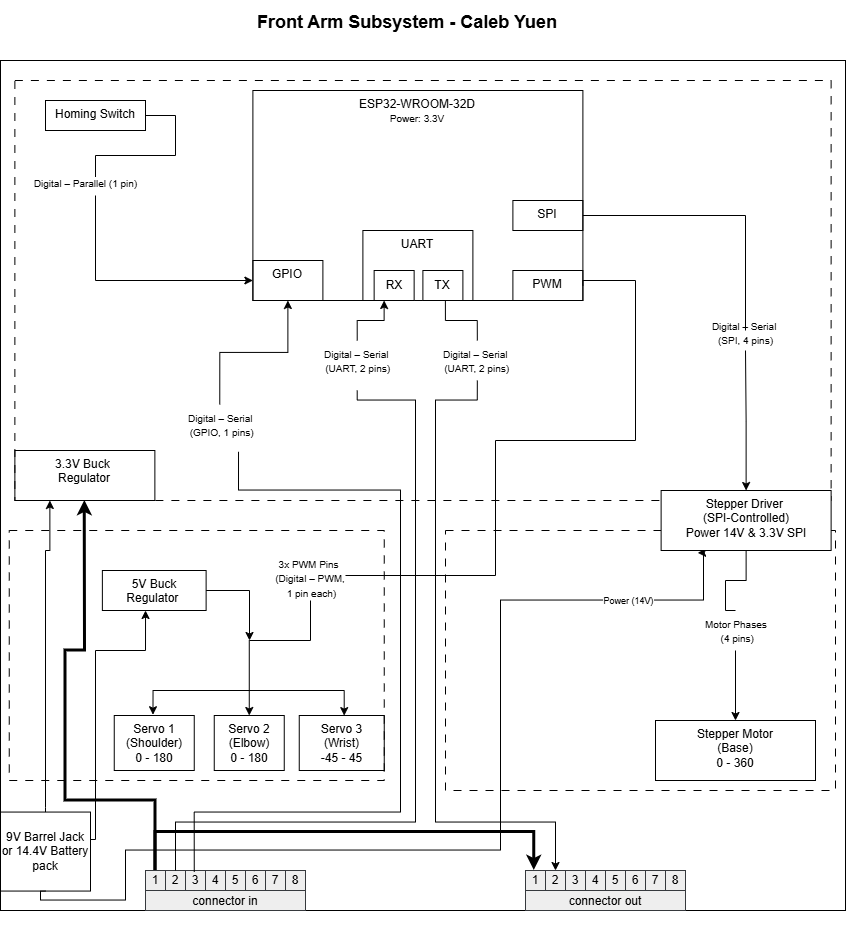

## Overview
This block diagram illustrates the electrical architecture of the Front Arm Subsystem for CropScout.
The subsystem is centered around an ESP32 microcontroller powered from a 3.3V switching regulator. It communicates with the rest of the system through a bidirectional UART daisy-chain connection using RX and TX lines routed through the 2x4 modular connector.

The subsystem performs two primary actuation tasks:
- Stepper motor control for base rotation using an SPI-controlled stepper motor driver  
- Direct PWM control of three RC servos (shoulder, elbow, wrist)

Separate regulated power domains are implemented for logic (3.3V), servo power (5V), and high-current motor power (14V).
A homing switch provides positional reference feedback through a GPIO input.

### Key Interfaces
- **UART (RX/TX, bidirectional)**  
  Daisy-chain communication with upstream and downstream subsystems
- **SPI (4 pins)**  
  Control of stepper motor driver (MOSI, MISO, SCLK, CS)
- **PWM (3 GPIO pins)**  
  Direct control of shoulder, elbow, and wrist servos
- **GPIO (1 pin)**  
  Homing switch input

### Power Architecture
- **+14V DC input** via barrel jack  
- **3.3V switching regulator** for MCU and logic  
- **5V regulator** for servo power  
- **+14V rail** used directly by the stepper motor driver  

> **Note:** RC servos are included as stretch goals and are an instructor-approved exception to the standard EGR 314 actuator constraints.

