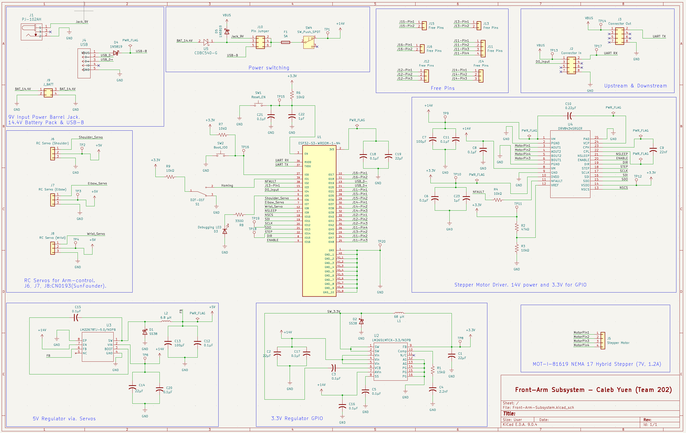

### Overview

This schematic supports the full Front Arm Subsystem of the EGR 314 exploration rover.  
It integrates power management, motion control, and microcontroller interfacing into a single modular design.
The Symbols for the Barrel jack, ESP32, 3.3V/5V Regulator, and Stepper Motor Driver was sourced by Digikey.

The system includes:

- +14V input from 14V barrel jack or 14.4V battery pack
- Protection main SMD fuse on the +14V input rail
- 5V buck regulator dedicated to servo power
- 3.3V buck regulator for ESP32-S3 and logic
- DRV8434S stepper motor driver (SPI controlled)
- Three RC servo outputs (Shoulder, Elbow, Wrist)
- UART daisy-chain communication interface
- USB programming and debugging interface
- Fault monitoring and current limiting via VREF network

This schematic ensures clean power distribution, safe current limiting for the NEMA 17 motor (1.2A rated), and robust GPIO-level interfacing at 3.3V.

### Full System Schematic
{style width:"450" height:"400;"}
**Figure 5.1** – Front Arm Subsystem Electrical Schematic

### Key Functional Blocks

#### Power Management
- 14V Input Selection (Barrel Jack / Battery)
- LM22678 5V Buck Regulator for Servos
- LM2651 3.3V Buck Regulator for ESP32 & Logic
- Proper decoupling, filtering, and PWR_FLAG validation
- Fuse (F1) on the +14V rail before feeding the rest of the board

#### Stepper Motor Control
- DRV8434S Stepper Driver
- Adjustable current limit via VREF resistor divider
- SPI configuration (SCLK, SDI, SDO, NSCS)
- STEP/DIR control
- nFAULT monitoring (open-drain with pull-up)

#### Servo Outputs
- Three 5V PWM-controlled RC servo headers
- Dedicated +5V rail
- Shared system ground

#### Microcontroller Interface
- ESP32-S3-WROOM-1
- 3.3V logic
- UART daisy-chain interface
- USB interface for programming
- Reset and Boot control circuitry

### Resources

- [Download Full Schematic PDF](Front-Arm-Subsystem.pdf)
- [Download Project ZIP](Front-Arm-Subsystem.zip)

