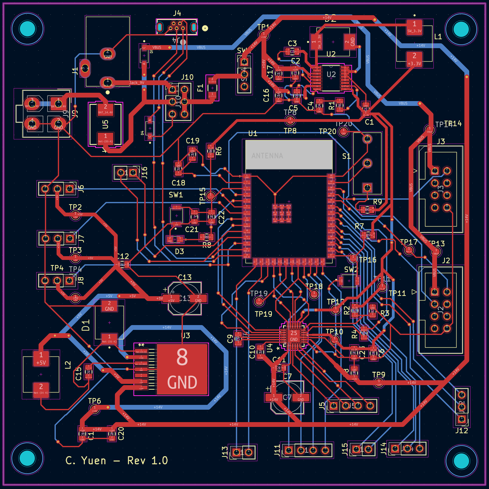
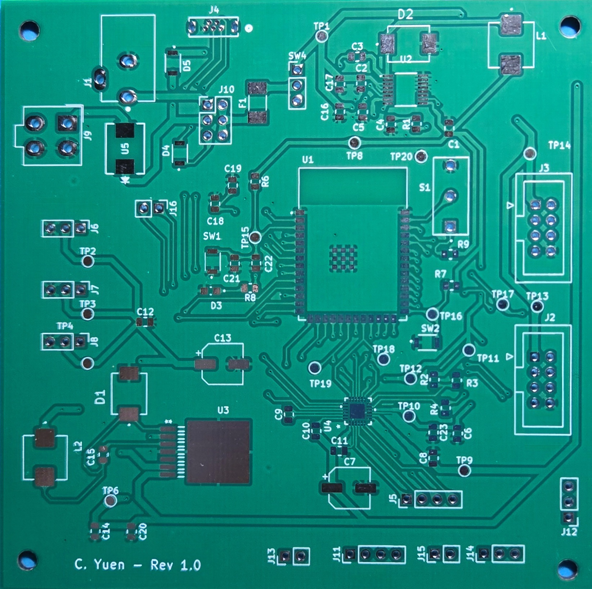
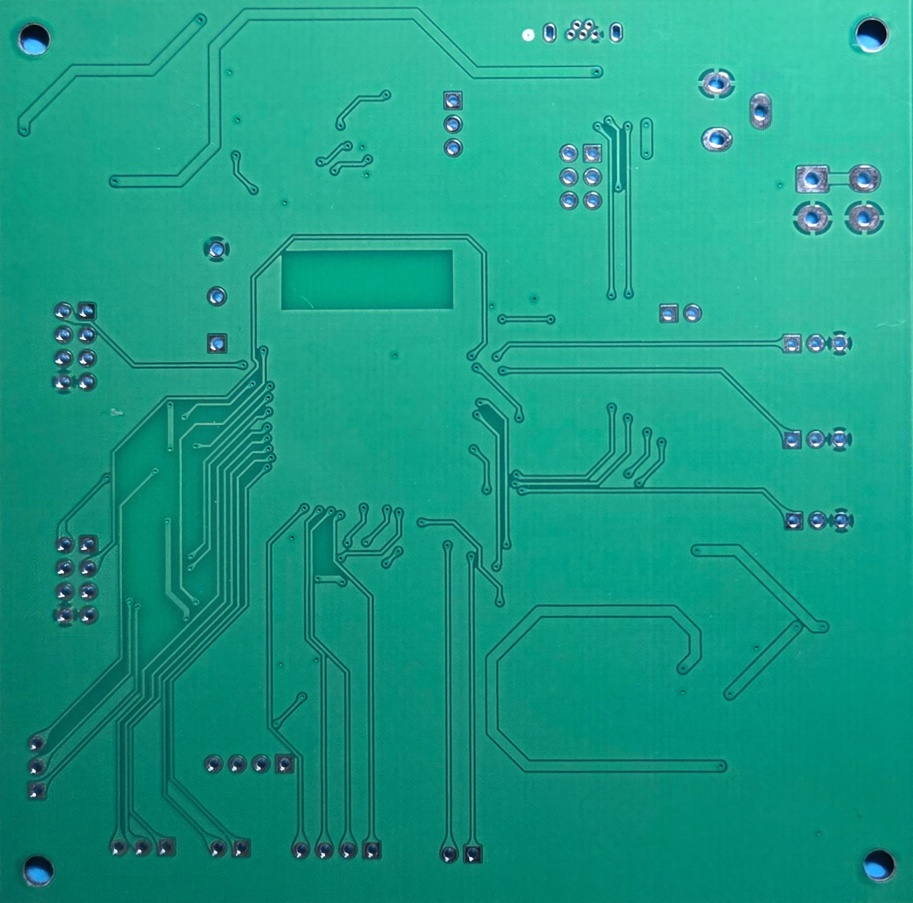
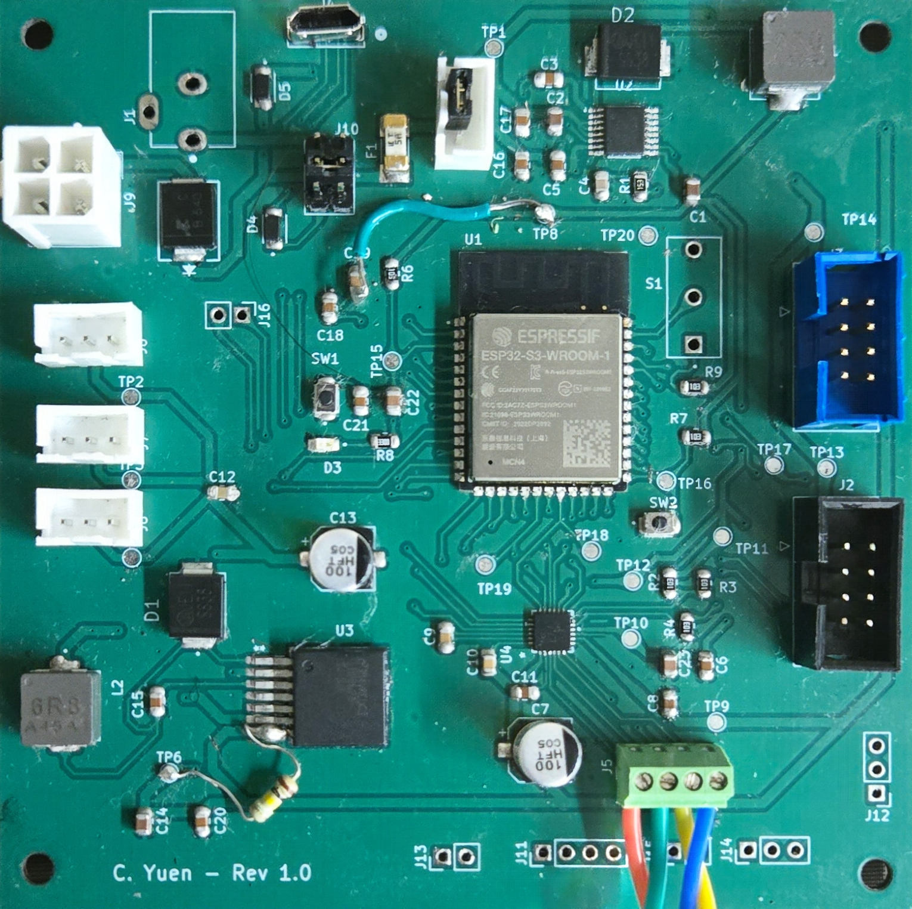

## Overview

This page documents the PCB design for the Front Arm subsystem. The board is designed as a standalone module for the EGR 314 exploration device and supports power regulation, microcontroller control, UART communication, and stepper motor actuation. The design follows the modular subsystem requirements of the course, where each board must operate independently and connect to the team daisy chain network through the shared 2x4 ribbon cable standard.

The PCB integrates the main hardware needed for the arm base rotation system, including the ESP32 based controller, power regulation stages, communication connections, and the DRV8434S stepper motor driver. The stepper driver was selected because it supports SPI communication, STEP and DIR motor control, and microstepping up to 1/256 step, which makes it well suited for accurate arm positioning. 

---

## Design Goals

### The main goals of this PCB were to:
1. create a standalone arm control board for the team system  
2. accept power from the project battery and distribute regulated voltages to the logic and motor sections  
3. control a stepper motor for arm base motion  
4. communicate safely over the UART daisy chain  
5. keep the layout modular, organized, and safe for team level integration 

---

## PCB Preview

### PCB Layout Render
{style width:"450" height:"400;"}

*Figure 6.1 Final PCB layout render from the ECAD software.*

### PCB Top View

*Figure 2. Manufactured PCB top side.*

### PCB Bottom View

*Figure 3. Manufactured PCB bottom side.*

### Fully Assembled Board

*Figure 4. Fully assembled Front Arm subsystem PCB.*

---

## Functional Description

The PCB acts as the hardware platform for the Front Arm subsystem. It receives power from the system battery or external supply, regulates voltage for onboard electronics, and controls the stepper motor driver used for arm movement. The ESP32 handles subsystem logic, message passing, and motor control signals. The board also provides the required subsystem level communication and physical connections for integration with the team’s larger exploration device network.

At the actuator stage, the DRV8434S stepper motor driver converts digital control inputs into controlled current outputs for the bipolar stepper motor. The DRV8434S supports SPI configuration, STEP and DIR control, integrated current sensing, fault reporting, and protection features such as undervoltage lockout, overcurrent protection, and thermal shutdown.

---

## Major Components Used

### ESP32 Microcontroller Module

The board uses an ESP32 module as the subsystem controller. The ESP32-S3-WROOM-1 family supports 3.0 V to 3.6 V operation, provides multiple GPIOs, and includes UART, SPI, I2C, and other peripherals useful for embedded subsystem control. The module also requires attention to pin strapping behavior and antenna keepout area during PCB layout.

### DRV8434S Stepper Motor Driver

The DRV8434S was chosen as the main motor driver because it is designed for bipolar stepper motors and supports:

- SPI interface with STEP and DIR pins  
- up to 1/256 microstepping  
- 4.5 V to 48 V motor supply range  
- up to 2.5 A full scale current  
- integrated current sensing without external sense resistors  
- nFAULT output for fault reporting 

This part helps reduce PCB area and simplifies current regulation compared to older stepper driver options.

### 5 V Buck Regulator

The LM22678 is a high voltage step down regulator that can accept 4.5 V to 42 V input and provide up to 5 A load current. This makes it a strong candidate for converting the battery input down to a regulated 5 V rail for the board. It also includes integrated soft start and current limiting. 

### 3.3 V Regulator

The LM2651 is a high efficiency switching regulator that supports 4 V to 14 V input and can generate logic level voltages such as 3.3 V for controller electronics. It was considered for the low voltage logic rail due to its efficiency and support for battery powered applications. 

### Battery Source

The battery pack used for the project is a 10.8 V lithium-ion pack rated at 10000 mAh and 108 Wh. It has a maximum continuous discharge current of 8.0 A and uses a 6-pin Mini-Fit Jr connector with duplicated power pins and SMBus communication lines.

---

### Resources
- [Download PCB Gerber Files project ZIP](Front-Arm-Subsystem-GerberFIles.pdf)
- [Download DFM analysis report](DFM-analysis-report.pdf)
- [Download Project ZIP](Front-Arm-Subsystem.zip)
