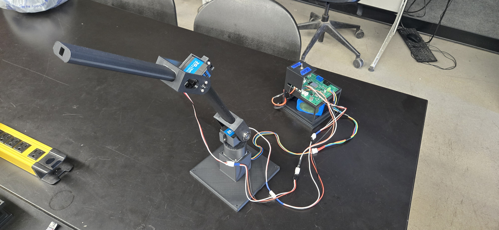
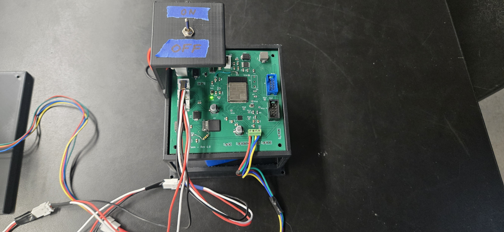
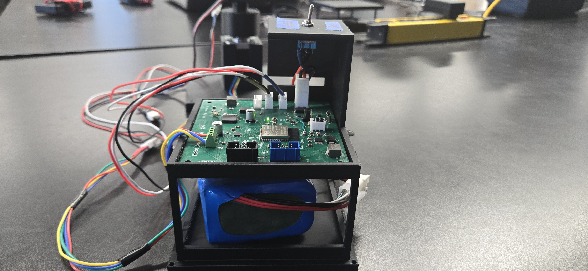

# Resources

## Overview

This page consolidates the final deliverables for the Front Arm Subsystem, including source code, demonstration videos, mechanical files, and reference documentation. These resources are intended to allow another engineer to reproduce, build upon, or maintain the subsystem after the project handoff.

## Mechanical and Enclosure Files

The 3D-printed mounting brackets, arm linkages, and motor housings used in the final assembly are included below.

- [Download Front-Arm-Subsystem-CAD Source Files (.zip)](CAD-Front-Arm-Subsystem.zip) 

## Source Code

The complete ESP32-S3 firmware project for the Front Arm Subsystem is available as a downloadable archive. The project contains the main control loop, the UART daisy-chain forwarding logic, the message parser implementing the API defined on the API page, the DRV8434S SPI initialization and STEP/DIR routines, the LEDC PWM drivers for the shoulder and elbow servos, and the homing-switch handler.

- [Download Front-Arm-Subsystem Project code (.zip)](Front-Arm-Subsystem-FinalCode.zip) 

## Individual Images

### Integrated Images

{style width:"450" height:"400;"}

{style width:"450" height:"400;"}

{style width:"450" height:"400;"}

## Demonstration Videos

The videos below document the final state of the Front Arm Subsystem operating in standalone mode and as part of the integrated CropScout system.

### Standalone Bench Test

<iframe width="560" height="315" src="https://www.youtube.com/embed/4-FvI283g2g" title="Front Arm Standalone Bench Test" frameborder="0" allow="accelerometer; autoplay; clipboard-write; encrypted-media; gyroscope; picture-in-picture" allowfullscreen></iframe>

This clip shows the stepper motor performing the homing routine, executing left and right base rotation commands, and the shoulder and elbow servos responding to direction commands.

### Integrated System Test

<!-- Replace VIDEO_ID_2 with the YouTube video ID for the team integration test -->
<iframe width="560" height="315" src="https://www.youtube.com/embed/VIDEO_ID_2" title="Front Arm Integrated System Test" frameborder="0" allow="accelerometer; autoplay; clipboard-write; encrypted-media; gyroscope; picture-in-picture" allowfullscreen></iframe>

This clip shows the Front Arm responding to live commands from the HMI subsystem through the team daisy-chain network, including the position acknowledge, status, and error message return paths.

